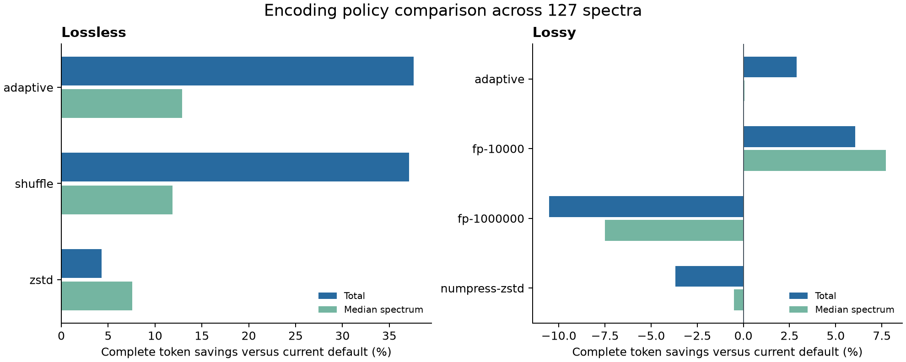

# Encoding findings

Measured 127 complete spectra from 40 local corpus datasets, with 36,634 array pipeline comparisons. Every selected spectrum retained its peaks and metadata. Input hashes, selected IDs, and environment are recorded in [results.json](results.json). See [method and reproduction](README.md) and [full measurements](measurements.md).

Follow-up: the [full PSI mode sweep](PSI_SWEEP.md) includes the previously
missing dictionary-encoded Zstandard codec. It improves the default-level
PSI lossless selector from 5.37 MB to 5.14 MB of array payloads. Adding modular
delta with zlib 6 then reduces that total to 3.88 MB, a further 24.59%.
The initial results below retain their original baselines and measurements.

## Recommended direction

The strongest immediate candidate is a lossless policy that selects the smallest existing codec per array from raw zlib, raw Zstandard, and byte-shuffled Zstandard. Keep the current lossy default for now. Develop reversible delta plus byte shuffling as a separate format experiment, particularly for m/z arrays.

These measurements were recorded before the adaptive lossless default was implemented. The experiment pins raw zlib as its lossless baseline so reruns remain comparable. The corpus is a selected local sample rather than a held-out instrument population. The delta pipeline remains an unregistered proposal, described in [the byte contract](../../docs/delta-codec-proposal.md).

## Complete tokens with supported codecs

Savings below compare against the current default in the same mode. Positive numbers mean smaller tokens. Total savings weight by bytes, while median savings weight each spectrum equally.

| Mode and candidate | Total savings | Median savings | Largest token increase | Smaller tokens |
| --- | ---: | ---: | ---: | ---: |
| Lossless, raw Zstandard level 3 | 4.32% | 7.56% | 19.98% | 87 / 127 |
| Lossless, byte-shuffled Zstandard level 3 | 37.11% | 11.89% | 33.50% | 115 / 127 |
| Lossless, smallest supported codec per array | 37.61% | 12.90% | 0% | 120 / 127 |
| Lossy, Numpress plus Zstandard level 3 | -3.69% | -0.51% | 15.26% | 42 / 127 |
| Lossy, smallest supported codec per array | 2.88% | 0.07% | 0% | 79 / 127 |

Byte shuffling is a substantial lossless improvement, especially for profile spectra. Its largest regressions occur in mobility-rich examples. The HeLa PASEF MS1 token grew from 17,974 to 23,996 characters. An MRM example grew from 32,315 to 41,815 characters. The mobility arrays themselves compress much worse after shuffling. Very short SRM spectra also pay extra framing overhead. Retaining the raw zlib candidate avoids these regressions.

The adaptive experiment selects among existing codecs, including a lossless representation when it is smaller than Numpress. It never enlarged a token or increased any measured error metric on this sample. Its lossy median benefit is only 0.07%, so the trial encoding cost is difficult to justify as a universal default.

Summed Python encoding times were 2.261 seconds for current lossless, 0.123 seconds for shuffled Zstandard, and 2.591 seconds for adaptive lossless. Current lossy took 0.470 seconds, Numpress with Zstandard took 0.147 seconds, and adaptive lossy took 1.060 seconds. These are sums of per-spectrum median times from this machine. The adaptive implementation is an unoptimized proof of concept that includes candidate search and final re-encoding.

## Delta helps, especially before shuffling

These measurements are compressed array payloads, excluding token framing and codec descriptors. Each lossless row covers the same arrays and compares against raw bytes plus zlib level 6.

| Transform and compressor | Total payload savings | Median array savings |
| --- | ---: | ---: |
| Modular delta, zlib 6 | 37.96% | 1.79% |
| Byte shuffle, zlib 6 | 41.66% | 16.02% |
| Modular delta then byte shuffle, zlib 6 | 49.12% | 15.38% |
| Modular delta then byte shuffle, Zstandard 3 | 47.81% | 11.46% |
| Modular delta then byte shuffle, Zstandard 9 | 49.73% | 12.81% |
| Modular delta then byte shuffle, Brotli 5 | 51.08% | 16.86% |
| Modular delta then byte shuffle, Zstandard 19 | 52.81% | 15.45% |

The transform is at least as important as the compressor. Delta plus shuffled Zstandard 3 took 54 milliseconds of aggregate encoding time for these arrays, compared with 1,187 milliseconds for delta plus shuffled zlib 6, 234 milliseconds for Brotli 5, and 1,922 milliseconds for Zstandard 19. Higher compression levels buy additional size reduction at substantial encoding cost.

At Zstandard level 3, delta plus shuffling reduced m/z payloads by 68.72%, compared with 47.93% for shuffling alone. For intensity the relationship reversed: delta plus shuffling saved 8.43%, while shuffling alone saved 17.73%. Applying the same transform to every array loses useful opportunities.

Profile arrays saved 53.84% with delta plus shuffled Zstandard 3, while centroid arrays saved 21.00%. The 47.81% combined figure is weighted toward large profile arrays.

These deltas are modular differences of unsigned IEEE-754 bit patterns. Their inverse preserves every bit. Floating-point subtraction followed by cumulative summation is not generally lossless. XOR and second-difference variants were also tested, but neither beat first-difference plus shuffle in total payload size at Zstandard level 3. New delta pipelines require a defined codec and interoperability work before they can be emitted as spectrl tokens.

## Lossy precision and other compressors

Changing only the compressor preserves Numpress's decoded arrays. For the eligible Numpress payloads, Zstandard 3 enlarged bytes by 3.76%, while Zstandard 19 saved 4.83%, XZ saved 4.72%, and bzip2 saved 7.41%. The median bzip2 payload grew 14.38%, demonstrating how large profile arrays can dominate totals. Brotli 5 was close to zlib in total size, with 0.38% growth. LZ4 enlarged Numpress payloads by 32.30%. Zlib 9 saved just 0.42% with greater encoding cost. Gzip 6 added 12 bytes per array compared with zlib 6 in this run.

The current m/z Numpress predictor already uses fixed-point linear prediction, as described by the [upstream implementation](https://github.com/ms-numpress/ms-numpress). Precision changes should be exposed as explicit quality settings.

| m/z fixed point with Zstandard 3 | Complete token savings vs current default | Maximum observed m/z absolute error |
| --- | ---: | ---: |
| 10,000 | 6.07% | about 0.00005 m/z units |
| 100,000 | -3.69% | about 0.000005 m/z units |
| 1,000,000 | -10.52% | about 0.0000005 m/z units |

The current default uses 100,000 with zlib. All three rows above use the same Zstandard wrapper, so comparisons between those rows isolate the fixed-point choice. Intensity precision is unchanged in this sweep.

Float32 narrowing with delta plus shuffled Zstandard 3 reduced m/z payloads by 19.86% relative to the current lossy m/z default, but enlarged intensity payloads by 47.64%. Its maximum observed m/z error was 0.000244136 m/z units, compared with about 0.000005 m/z units for the current Numpress default. Maximum relative m/z error was about 0.060 ppm. These accuracy measures express different tradeoffs, so float32 should not silently replace the current precision contract.

Float32 conversion was numerically exact for 102 of 127 m/z arrays and 125 of 127 intensity arrays, reflecting the source corpus's stored precision. A future experiment could detect exact narrowing per array. That requires decisions about returned dtypes and the lossless API contract.

The existing SLOF transform's maximum peak-normalized intensity error was 0.01416%. Its maximum relative error was 100% for near-zero intensities that rounded to zero. Maximum relative error alone is therefore insufficient to describe intensity fidelity. Full observed errors are in [array-errors.json](array-errors.json).

## Validation

All 36,634 array pipeline cases decoded to the expected transformed result. Lossless cases additionally passed byte equality against the canonical raw source. All 1,143 complete tokens round-tripped. All requested fixed points were accepted on this sample. Adaptive policies passed per-spectrum size and numeric-error nonregression assertions. Random bit-pattern and floating-point edge checks passed, as did 36 existing codec and round-trip tests and Ruff checks for the experiment scripts.
